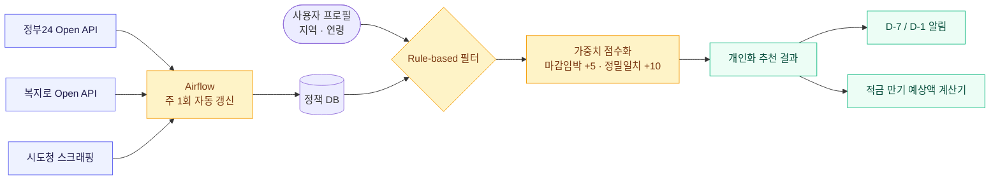
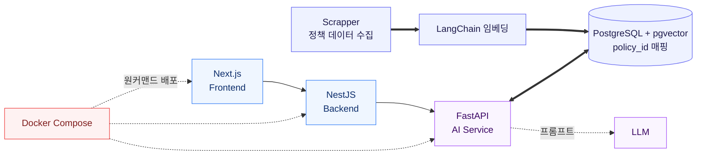
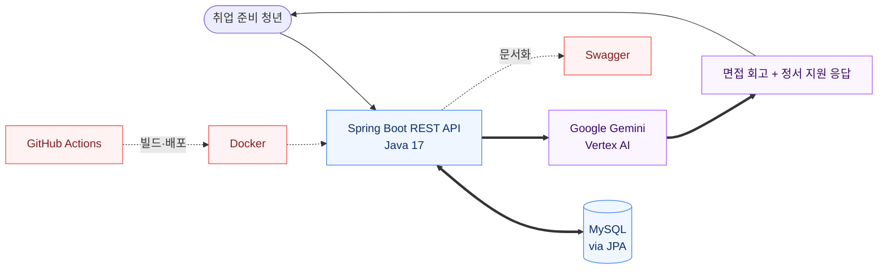
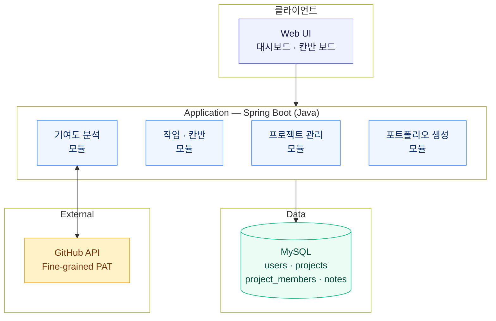

# 차지만 (Cha Jiman)

클라우드 인프라 위에서 **데이터와 AI 시스템이 안정적으로 동작하는 구조**에 관심이 많은 클라우드, DevOps, 인프라 지향 개발자입니다.
"잘 만든 시스템"보다 "왜 느린지 설명할 수 있는 시스템"을 만드는 데 시간을 씁니다.

- 삼육대학교 컴퓨터공학부 4학년 학부연구생
- KSCI 학술지 게재 — *대규모 실시간 데이터 파이프라인의 End-to-End 지연시간 최적화* (2026)
- 교내 SW프로젝트 공모전 최우수상 (2025)
- 관심 분야: Infra / DevOps · Cloud · Kubernetes · OpenStack · 데이터 파이프라인
- 📧 cjm042352@gmail.com&nbsp;&nbsp;|&nbsp;&nbsp;📄 [Portfolio (Notion)](https://graceful-cheddar-9e4.notion.site/Developer-Portfolio-527d8e51100c832f96e681af1da0903e?pvs=74)

---

## 대표 프로젝트

> 프로젝트 코드는 팀·조직 저장소에 있습니다. 각 제목에서 원본으로 이동할 수 있습니다. 진행 중인 프로젝트는 준비되는 대로 공개할 예정입니다.

### 1. 실시간 데이터 파이프라인 — End-to-End ([↗ 저장소](https://github.com/kakaocloud-edu/tutorial/tree/main/DataAnalyzeCourse))

`2025.01 ~ 2025.08`

**KakaoCloud 공식 교육 콘텐츠**(★25)에 포함된 실시간 데이터 파이프라인 실습 코스 및 파이프라인을 설계·구현.

- **수집 → CDC 처리 → ML 학습·서빙**까지 전 구간 아키텍처 설계
- FSM 기반 E-commerce 트래픽 제너레이터 설계
- Nginx 커스텀 로그(18개 필드) → Filebeat → Logstash → Kafka(Avro/Schema Registry) 수집 파이프라인
- Kafka·Kafka Connect·Debezium(CDC)로 이종 소스를 단일 스트림으로 통합
- PySpark(Structured Streaming) + Delta Lake로 스트리밍·배치 통합 처리
- Hive External Table → Aggregated Table → Data Mart 3계층 데이터 모델 설계
- Kubeflow 파이프라인 학습 → KServe 서빙까지 자동화
- `KakaoCloud` `Kafka` `Spark` `Hadoop` `Kubeflow` `KServe` `Python` `Go`

```mermaid
flowchart LR
    TG["Traffic Generator VM"] ==>|LogData| ALB["ALB"]
    ALB ==> API["API Server VM<br/>Nginx"]
    API ==> FB["Filebeat"] ==> LS["Logstash"] ==>|LogData| KFK["Kafka"]
 
    API --> DB[("MySQL")]
    DB -.-> DBZ["Debezium CDC"] -.-> DS["Data Stream VM"] -.DBData.-> KFK
 
    SR["Schema Registry<br/>Avro"] -.직렬화.-> KFK
 
    KFK ==> KC["Kafka Connector VM"] ==> OS[("Object Storage")]
    OS ==> SPK["Spark Structured Streaming"] ==> DL[("Delta Lake")]
    DL ==> HIVE["Hive<br/>External → Aggregated → Data Mart"]
    HIVE --> QRY["Druid · Superset · Tez · Hue"]
    HIVE ==>|정제 데이터| KFL["Kubeflow"] ==> KS["KServe"]
 
    USER(["사용자"]) --> LB["LB"] --> KFL
    MON["Monitoring Flow"] -.-> ALERT["Alert Center"]
 
    classDef gen fill:#eef2ff,stroke:#6366f1,color:#1e1b4b
    classDef collect fill:#eff6ff,stroke:#3b82f6,color:#0c2d6b
    classDef stream fill:#fef3c7,stroke:#f59e0b,color:#78350f
    classDef store fill:#ecfdf5,stroke:#10b981,color:#064e3b
    classDef ml fill:#faf5ff,stroke:#a855f7,color:#3b0764
    classDef ops fill:#fef2f2,stroke:#ef4444,color:#7f1d1d
 
    class TG,ALB gen
    class API,FB,LS,DB,DBZ,DS collect
    class KFK,KC,SR stream
    class OS,SPK,DL,HIVE,QRY store
    class KFL,KS,LB,USER ml
    class MON,ALERT ops
```



---

### 연구

**대규모 실시간 데이터 파이프라인의 End-to-End 지연시간 최적화** — KSCI, 2026.05
[DOI: 10.9708/jksci.2026.31.05.011](https://doi.org/10.9708/jksci.2026.31.05.011)

파이프라인의 어떤 설정이 전체 지연시간에 영향을 주는지 정량 측정·분석.

- VM 3대에서 트래픽을 병렬 생성해 클라이언트 병목을 차단하고, ALB를 경유해 분산 인가
- 파이프라인 **7단계 구간별 ms 단위 지연시간 추적 시스템** 직접 설계
- Baseline 포함 **5개 튜닝 시나리오** 설계·실험

**핵심 발견**

| 시나리오 | 결과 |
| :--- | :--- |
| Baseline | CPU 64%로 여유가 있는데도 E2E 1.8~2.0초 → 리소스가 아닌 **정책**이 병목 |
| Zero-Wait | 패킷 9,266 pck/s 폭증 → 처리량 **초당 188건까지 강제 제한** |
| 마이크로배치 | 처리량 초당 935건까지 급증하나 큐 백로그로 **지연 80~100초 붕괴** |
| 스캔주기 최적화 | 스캔 주기 10ms로 단축 → 배치가 차기 전에 지속 배출, 트래픽 셰이핑 효과로 **지연 1초 미만 회복** |
| **하이브리드** | 앞단 I/O 통제 + 뒷단 무대기 배출 → **CPU 68% 안정 + E2E 지연 0.5초 미만** |

> 앞단 최적화가 뒷단 처리 용량을 넘어서면 병목은 사라지지 않고 **전이**된다.
> 튜닝은 국소 최적화가 아니라 전체 데이터 흐름을 봐야 한다.

---

### 2. SU Cloud — 학교 자체 OpenStack 프라이빗 클라우드

`2026.06 ~ 진행 중`

학교 유휴 서버(20코어 CPU × 2대)를 활용해 학생들이 온디맨드로 사용하는 자체 프라이빗 클라우드 구축.

- **Phase 1** — OpenStack 코어 컴포넌트 설치 및 외부 접근 경로 확보
- **Phase 2** — 셀프서비스 대시보드: 신청 → 인증 → VM 자동 프로비저닝
- 학교 망을 경유하는 트래픽 처리를 위한 네트워크 설계
- `OpenStack` `Network Design` `On-premise`

---

### 3. VMLease — 멀티클라우드 VM 자동화 Kubernetes Operator

`2026.05 ~ 진행 중`

Kubernetes **Operator 패턴(CRD + Controller)**을 직접 구현. CR 하나를 생성하면 KakaoCloud·AWS·GCP 중 원하는 클라우드에 VM이 자동 생성되고, 만료 시각이 지나면 자동 삭제됩니다.

- Kubebuilder로 `VMLease` CRD(Spec/Status) 스키마 설계, Controller 상태 머신 + Finalizer로 삭제 시 실제 VM 정리 보장
- Provider Interface 패턴으로 CSP별 구현체를 분리 — 신규 클라우드는 인터페이스 구현만으로 확장, 컨트롤러 코드 수정 불필요
- 컨트롤 플레인(K8s)과 워크로드(VM)를 분리 설계해 kind·k3s·EKS·GKE 어디서든 동일 동작
- CSP별 인증 정보는 Kubernetes Secret으로 분리 관리
- kind(Kubernetes in Docker)로 개발 환경 구성
- `Go` `Kubebuilder` `Kubernetes` `CRD/Controller` `KakaoCloud` `AWS` `GCP`

```
[K8s 클러스터 = 컨트롤 플레인]
  VMLease Controller
        ├── KakaoCloud API ──▶ [KakaoCloud VM]
        ├── AWS EC2 API    ──▶ [AWS VM]
        └── GCP Compute API ─▶ [GCP VM]
```

---

### 4. 청년정책·적금 혜택 추천 앱 ([↗ 저장소](https://github.com/cjm0423/2025SW))

`2025.04 ~ 2025.09` · 교내 SW프로젝트 공모전 최우수상 · **팀장 · 풀스택 · 크롤링 · AI 추천 로직 담당**

*"나에게 맞는 혜택을 직접 찾는" 방식을 → "내 정보를 넣으면 맞는 혜택만 보이는" 방식으로 역전*

- 정부24·복지로 Open API + 시도청 스크래핑, Airflow 주 1회 자동 갱신
- Rule-based 필터(지역·연령) + 가중치 점수화(마감 임박 +5점, 정밀 일치 +10점)
- 마감 D-7 / D-1 알림, 적금 만기 예상액 계산기, 카카오 로그인 연동
- → 이 아이디어가 **캡스톤2의 RAG 기반 정책 추천**으로 고도화
- `Kotlin` `Android` `Kakao Login`



---

### 5. 정부 정책 개인화 추천 AI 챗봇 (캡스톤·**팀장**) ([↗ 저장소](https://github.com/26-1capstone-design2))

`2026.03 ~ 2026.06` · 삼육대 SW중심대학사업단 × 알라딘에이아이 산학협력

LangChain·RAG 기반으로 사용자 질의에 맞는 정책 문서를 검색해 LLM이 답변을 생성하는 서비스.

- 정책 데이터 수집(scrapper) → AI 서비스(aiservice) → 백엔드·프론트로 이어지는 풀스택 구성
- **pgvector** 벡터 검색 + LangChain 임베딩, `policy_{id}` 형식으로 RDBMS 레코드와 매핑
- `POST /internal/ai/chat` — 프로필(연령·지역·관심분야) 메타데이터 필터링 → 유사 정책 검색 → LLM 프롬프트 주입 → **답변 + 근거 정책 카드** 반환
- Docker Compose로 FE(Next.js)·BE(NestJS)·AI(FastAPI) 3-tier 통합, 원커맨드 배포 + DB 마이그레이션 자동화
- 청년구직자 / 소상공인 / 지자체 담당자 3개 페르소나 기반 기능 설계
- `LangChain` `RAG` `FastAPI` `NestJS` `Next.js` `PostgreSQL+pgvector` `Docker`
 


---

### 6. ONE WAVE — 취업 준비 청년을 위한 면접 회고·정서 지원 웹 ([↗ 저장소](https://github.com/2026-GDGoC-Hackathon-ONE-WAVE))

`2026.02` · 2026 GDGoC 해커톤 · **백엔드 담당**

취업난 속 청년들에게 **면접 회고**를 제공하고 결과에 따른 **감정 위로**를 건네는 웹 서비스.

- Spring Boot(Java 17) 기반 REST API 설계, JPA·MySQL로 데이터 관리
- Google Gemini(Vertex AI)를 연동해 회고·정서 지원 응답 생성
- Swagger로 API 문서화, Docker·GitHub Actions로 빌드·배포 자동화
- **설계 원칙**: 평가 금지 / 현상 관찰 / 행동 연결 / 멘탈 케어 — 사용자에게 '부족함'이라는 낙인을 찍지 않는다
- `Spring Boot` `Java` `JPA` `MySQL` `Vertex AI` `Docker` `GitHub Actions`



---

### 7. 캡스톤 매니저 — 프로젝트 협업 플랫폼 ([↗ 저장소](https://github.com/mk8048/Sanhak_CapstoneDesign))

`2025.09 ~ 2025.12` · **DB 설계 · API 연동 담당**

캡스톤 진행 시 산출물 관리·기여도 측정·포트폴리오 제작의 비효율을 해결하는 올인원 협업 플랫폼.

- ERD 및 관계형 스키마 설계 (users / projects / project_members / notes)
- **GitHub API 연동** — Fine-grained PAT 최소 권한 정립, 커밋·PR 기반 기여도 자동 분석
- 칸반 보드, 작업 의존성 처리, 단계별 진행률, 원클릭 포트폴리오 생성
- 비기능 요구사항 정의: 대시보드 2초 이내(800개 작업 기준), 동시 100팀/1,000명, 가용성 월 99%
- `Spring` `Java` `MySQL` `GitHub API`



---

## Activity

| 활동 | 기간 | 내용 |
| :--- | :--- | :--- |
| **교내동아리 CLOUDLAB 리더** | 2025.07 ~ | 클라우드/인프라/DevOps 커리큘럼 기획 · 2025-1 정규 3기부터 2026-1 정규 4기까지 운영 총괄 · 신입 부원 면접·선발 |
| **학부연구생 후임 멘토링** | 2025.07 ~ | Essential Course 개선 · 주간 발표 피드백 · Kubeflow Katib CrashLoopBackOff 트러블슈팅 지도 |
| **전남ICT이노베이션스퀘어 교육 자료 제작** | 2025.10 | KakaoCloud VM/VPC · 스냅샷/복원 · NGINX/Apache 배포 · 방화벽 및 포트 트러블슈팅에 대한 클라우드 기초 교육 커리큘럼 기획 및 자료 제작 |

---

## Tech Stack

- **Infra / DevOps** · `Kubernetes`  `Kubebuilder` `OpenStack` `Docker` `Linux` `Nginx` `Bash`
- **Cloud** · `KakaoCloud` `AWS` `GCP`
- **Data Engineering** · `Kafka` `Debezium` `Spark` `Delta Lake` `Hadoop` `Hive` `Logstash` `Filebeat`
- **ML / Serving** · `Kubeflow` `KServe` `LangChain` `RAG`
- **Backend** · `Spring Boot` `FastAPI` `MySQL` `PostgreSQL`
- **Language** · `Python` `Go` `Java`
- **Tools** · `Git`

---

